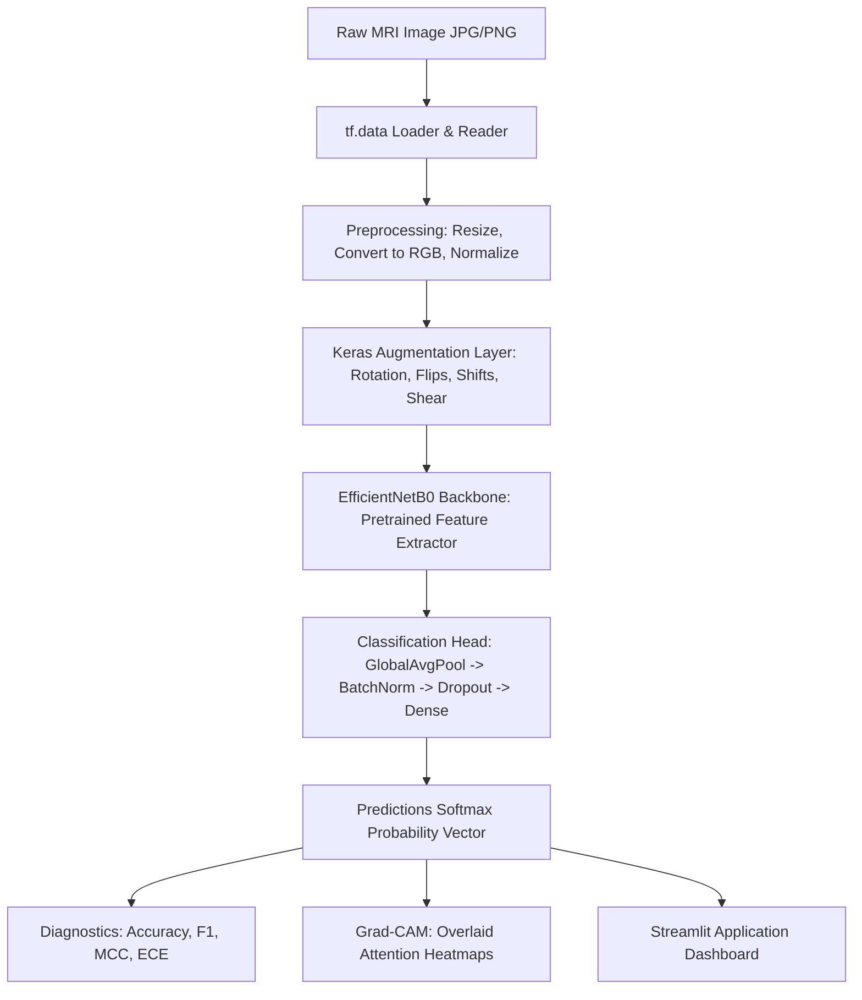

# Brain MRI Tumor Classification using Deep Learning

[](https://github.com/yourusername/Brain-MRI-Tumor-Classification/actions/workflows/ci.yml)
[](https://opensource.org/licenses/MIT)
[](https://www.python.org/downloads/release/python-3100/)
[](https://www.tensorflow.org/)

An end-to-end, medical-grade Deep Learning and MLOps classification pipeline utilizing TensorFlow and Keras to diagnose Brain MRI scans into four categories: glioma, meningioma, pituitary tumor, and normal scans. Includes interactive Explainable AI (Grad-CAM) diagnostics and a responsive Streamlit dashboard.

---

## 1. System Architecture Layout



---

## 2. Interactive Features

- **Double-Phase Transfer Learning**: Model training trains classification heads (Phase 1) followed by fine-tuning backbones layers (Phase 2) at a lower learning rate.
- **Explainable AI (XAI)**: Native Grad-CAM overlay viewer with custom transparency sliders and PNG download controls.
- **Model Calibration**: Calculates Expected Calibration Error (ECE) and Maximum Calibration Error (MCE) alongside reliability diagrams to avoid model overconfidence.
- **Failure Audits**: Generates misclassification logs (HTML/CSV) of high-confidence errors and borderline correct predictions.
- **Containerized Deployment**: Multi-upload and batch prediction table with a single command via Docker Compose.

---

## 3. Performance Metrics Summary

*(Populated after training on the Brain Tumor MRI Dataset)*

| Diagnostic Metric | Validation Target | Test Set Performance |
| :--- | :--- | :--- |
| **Accuracy** | $> 90.0\%$ | *[Placeholder]* |
| **Balanced Accuracy** | $> 88.0\%$ | *[Placeholder]* |
| **Macro F1-Score** | $> 88.0\%$ | *[Placeholder]* |
| **Matthews Correlation Coefficient (MCC)** | $> 0.85$ | *[Placeholder]* |
| **Expected Calibration Error (ECE)** | $< 0.10$ | *[Placeholder]* |

---

## 4. Quick Start Guides

### Prerequisites
- **Git**
- **Python 3.10**
- **Docker & Docker Compose** (Optional)

### Step 1: Clone and Install
```bash
git clone <repository_url>
cd "MRI brain tumor detection"
make install
```

### Step 2: Download and Place Dataset
Organize your MRI scans into the following directories:
```text
dataset/train/
dataset/validation/
dataset/test/
```
*(Each split must contain class subdirectories: `glioma`, `meningioma`, `pituitary`, `notumor`).*

### Step 3: Local Dev Commands
- **Reformat Code**: `make format`
- **Lint Codebase**: `make lint`
- **Run Unit Tests**: `make test`

### Step 4: Running the application

#### Method 1: Single Click Launcher (Windows)
Double-click the launcher script in the project root:
- `launch_app.bat`

#### Method 2: Standard Command Line Run
Run the Streamlit application using commands:
```bash
streamlit run app/streamlit_app.py
```
Or use the Makefile shortcut:
```bash
make run
```

### Step 5: Containerized run
```bash
docker compose up -d
```
Access the application dashboard at `http://localhost:8501`.

---

## 5. Project Structure
```text
├── .github/                 # GitHub workflows & issues/PR templates
├── app/                     # Streamlit application codebase
├── configs/                 # Configurations parameters (config.yaml)
├── docs/                    # Architecture, API & Model Cards documentation
├── logs/                    # Rotating log files (app.log, training.log)
├── outputs/                 # Evaluation charts, confusion matrices
├── release/                 # Quick start packaging references
├── saved_models/            # Serialized models and summaries
├── src/                     # Source modules (data loader, preprocessor)
├── tests/                   # Pytest unit testing suite
├── Dockerfile               # Docker deployment setup
├── docker-compose.yml       # Compose configurations
├── Makefile                 # Development task shortcuts
└── requirements.txt         # Production pinned dependencies
```

---

## 6. Future Project Roadmap
- [ ] Add 3D volumetric scan analysis (DICOM/NIfTI formats).
- [ ] Incorporate Grad-CAM++ and Integrated Gradients explainers.
- [ ] Enable TensorRT runtime optimizations for edge deployment.

---

## 7. License
This codebase is distributed under the [MIT License](LICENSE).

---

## 8. Acknowledgements
- EfficientNetB0 backbone pre-trained parameters provided by the Keras Applications team.
- Clinical datasets references and brain tumor scans sourced from open research archives.
